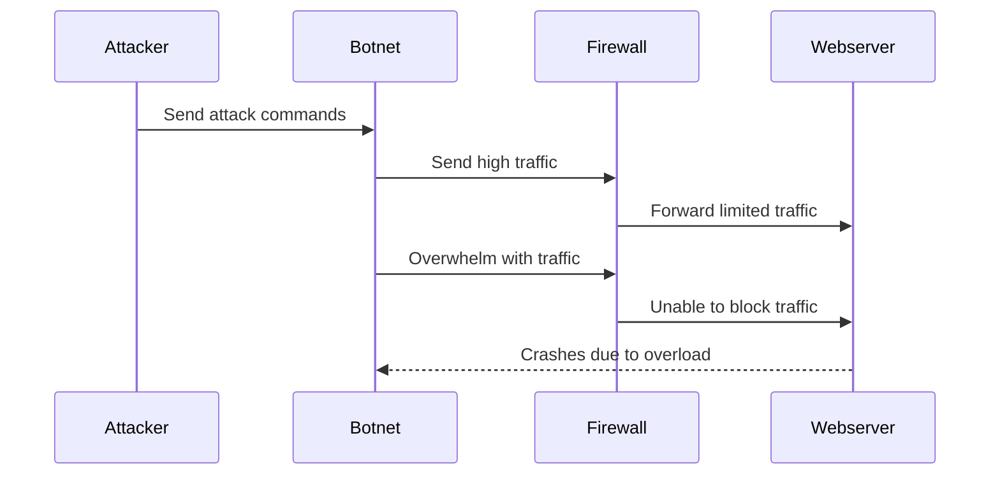

# DDOS Attack Sequence Diagram

### Documentation
First the attacker sends attack commands to the Botnet, which then sends high traffic and overwhelms with traffic to the Firewall. After, it forwards limited traffic to the webserver and also if its unable to block the traffic. They webserver may crash due to overload and go back to the botnet. 