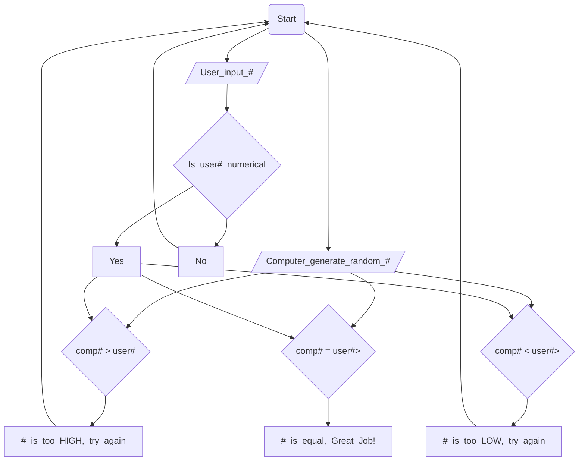

# Guessing Game Flow Chart

## Documentation
First, it starts at the start node.

Then moves on to User Input and asks if it is numerical. If it is, it moves on, if its not, they have to start back. 

At the same time, the computer has already generated its number. 

After both the user input and computer input has finished, it moves on to each of the decisions. 

If our number is less than the computer number, it makes us restart.

If our number is higher than the computer number, it also makes us restart.

If it is spot on, you won.

