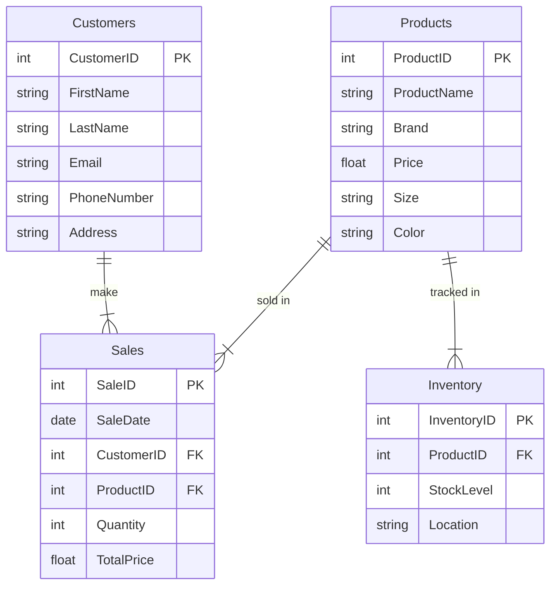

# Nike Store ERD

### Documentation
This ERD outlines the relationships between key entities in a shoe store: Products, Customers, Sales, and Inventory. It models how transactions and stock levels are tracked.

Entities Overview
Products

ProductID (PK): Unique identifier.
Includes name, brand, price, size, and color.
Customers

CustomerID (PK): Unique identifier.
Includes name, email, phone, and address.
Sales

SaleID (PK): Unique transaction ID.
Links CustomerID (FK) and ProductID (FK) with sale date and quantity.
Inventory

InventoryID (PK): Unique identifier.
Tracks stock by ProductID (FK) and location.
Relationships
Products are linked to sales and inventory.
Customers are linked to sales.